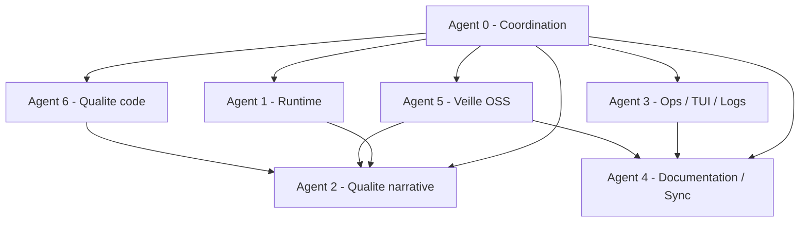

# Agents et sous-agents - 16 mars 2026

Carte operative des agents de travail pour `ai-novel-engine`.

Mise a jour : 16 mars 2026 (lot refonte — deep analyse + bugs + outline_like + tests).

Hypothese volontaire: ces agents sont des boucles de travail et de verification, pas une architecture de production multi-agents.

## Carte d'ensemble

## Agent 0 - Coordination

- mission: garder le repo coherent, prioriser, synchroniser plans/TODOs/README
- competences: lecture repo, triage, verification de fin de lot
- sous-agent `tracking-sync`: surveille les sections `AUTO-SYNC`
- sous-agent `release-memory`: tient les docs `CONTEXTE`, `MEMOIRE_REPRISE`, `EXECUTION_PLAN`

todo actif:
- [x] mascarade :8100 remonte
- [x] lot `baselines` valide : `qwen2.5:1.5b` → `quality_blocked ['truncated_ending']` (plus d'`outline_like`)
- [x] lot `priority_models` termine : `qwen3.5-4b` → `accepted`, `qwen2.5:7b` → `quality_blocked ['truncated_ending']`
- [x] lot `french_models` termine : `mistral-nemo` → `quality_blocked ['outline_like', 'incomplete', 'lacks_narrative_continuity']`
- [ ] resserrer prompts pour `qwen2.5:7b` et `mistral-nemo` (fin de scene + decision risquee)

## Agent 1 - Runtime

- mission: garder un backend local stable pour `provider:model`
- competences: `llama.cpp`, `llama-server`, healthchecks, preflight, shim OpenAI-compatible
- sous-agent `apple-runtime`: surveille `:8201` et le modele Apple actif
- sous-agent `llama-runtime`: prepare `:8091` et les alias `ollama:*`

todo actif:
- [x] mascarade :8100 remis en route (fix `supported_provider_names` → `available_providers`)
- [x] llama-server :8091 valide pour qwen2.5:7b
- [x] mistral-nemo:latest pull + llama-server valide
- [ ] automatiser le demarrage mascarade (script systemd ou launchd)

## Agent 2 - Qualite narrative

- mission: faire tomber les blockers prose une fois le runtime stabilise
- competences: prompts, `gate`, `repair`, lecture des artefacts de chapitre, patterns few-shot
- sous-agent `gate-reader`: regroupe `quality_blockers` depuis `gate_v1.json`
- sous-agent `prompt-surgeon`: n'agit que sur `draft_v1`, `rewrite_v1` et `repair_v1`

todo actif:
- [x] **output primer** dans `draft_v1`, `rewrite_v1`, `repair_v1` — livre (session 2)
- [x] **few-shot BAD/GOOD** dans `draft_v1`, `rewrite_v1`, `repair_v1` — livre (session 2)
- [x] relancer `ollama:qwen2.5:7b` — `quality_blocked ['truncated_ending']` (LLM gate : fin de scene incomplete)
- [x] relancer `ollama:mistral-nemo:latest` — `quality_blocked ['outline_like', 'incomplete', 'lacks_narrative_continuity']` (316 mots, prose trop condensee)
- [ ] renforcer cible `"decision risquee"` dans `rewrite_v1` et `repair_v1` pour `qwen2.5:7b`
- [ ] comprendre pourquoi `mistral-nemo` reste a 316 mots malgre budget 1024 — verifier completion stop token ou longueur systeme
- [ ] convertir la `structure` JSON en resume narratif avant injection dans `draft_v1` (pattern GOAT)

competences ajoutees (veille OSS):
- pattern GOAT-Storytelling-Agent : outline → narrative summary
- few-shot structure : exemple MAUVAIS / BIEN en 3-5 phrases
- output primer : injecter incipit partiel en fin de prompt

## Agent 3 - Ops / TUI / Logs

- mission: donner une lecture operateur simple et verifiable
- competences: scripts shell/python, TUI texte, retention des reports, analyse stderr
- sous-agent `report-analyst`: agrège `run.json` et logs
- sous-agent `cleanup-surgeon`: propose les purges dry-run avant suppression

todo actif:
- [ ] analyser et supprimer les logs de runs froids (`automation/reports/` anciens)
- garder `scripts/ops_tui.py` comme cockpit court terme
- ne purger que les workspaces ou logs clairement froids

## Agent 4 - Documentation / Sync

- mission: faire raconter la meme histoire aux README, plans, runbooks et TODOs
- competences: synthese, spec, mermaid, cartes de fonctionnalite
- sous-agent `spec-writer`: maintient la spec systeme et les feature maps
- sous-agent `manifest-keeper`: garde les chemins du manifeste coherents

todo actif:
- [x] OSS_LANDSCAPE mis a jour avec nouvelles trouvailles (GOAT, prometheus-eval, story-eval, outlines, DeepEval)
- [x] AGENTS mis a jour
- [x] FEATURE_MAP mis a jour
- [ ] mise a jour README.md apres fix outline_like
- garder les dates 16 mars comme point de reprise

## Agent 5 - Veille OSS

- mission: reperer les briques open source utiles sans deguiser ANE en framework generique
- competences: veille sourcee, comparaison produit, tri de dependances
- sous-agent `evals-scout`: regarde les briques eval/guardrails narratifs
- sous-agent `ui-scout`: regarde les cockpits locaux/TUI/web

suivi actif:
- `GOAT-Storytelling-Agent` — pattern outline→narrative a adapter dans `draft_v1`
- `prometheus-eval` — juge LLM avec rubrique personnalisable
- `story-evaluation-llm` — 15 criteres narratifs LLM-as-judge
- `dottxt/outlines` — contraintes logits anti-Markdown
- `DeepEval` — evals narratifs compatibles pytest
- `llama.cpp`, `Open WebUI`, `SillyTavern`, `koboldcpp` — references runtime/cockpit

## Agent 6 - Qualite code (nouveau)

- mission: corriger les bugs critiques et refactorer pour la maintenabilite
- competences: Python, analyse statique, refactoring, couverture de tests
- sous-agent `bug-hunter`: cible les bare excepts, les niveaux d'imbrication et les repetitions
- sous-agent `test-writer`: ajoute les tests manquants sur `cli/main.py`, `intention/gate.py`, `prompts.py`

todo actif:
- [x] fix 4 bare `except Exception` dans `next_lots.py`
- [x] refactorer `pipeline.generate_chapter()` : `_finish_stage()` extrait (pattern × 4 factorise)
- [x] robustifier `_close_json_delimiters()` dans `models.py` — rebuild car-par-car, mismatched + stray closers, 3 tests
- [x] refactorer 3 fonctions near-identiques dans `project/loader.py` — `_iter_chapters_with_status()`
- [ ] typer `metadata` avec `ChapterMetadata(TypedDict)` dans `pipeline.py` — reporte : 20+ signatures, P3
- [x] tests `cli/main.py` : 6 nouveaux tests CLI (invalid chapter, duplicate, empty content, no args, ProviderError x2) — 91 tests verts

## Agent 7 - Robustesse fichiers / reprise (nouveau)

- mission: eliminer les corruptions d'etat sur crash et fiabiliser la reprise
- competences: ecritures atomiques, tolerance JSON corrompu, runbooks de recovery
- sous-agent `atomic-writer`: applique `temp file + replace` sur les JSON critiques
- sous-agent `recovery-ops`: documente les procedures de reprise lot/meta/state

todo actif:
- [x] ecritures JSON atomiques sur `pipeline._write_json()` et `RunState.dump()`
- [x] lectures tolerantes aux JSON corrompus dans `pipeline` et `loader`
- [x] runbook `docs/runbooks/RECOVERY_PROCEDURES.md` cree
- [ ] ajouter tests unitaires dedies aux corruptions JSON (meta/state)

## Agent 8 - Remote runtime Mascarade (tower/kxkm)

- mission: piloter les cibles SSH distantes sans casser la boucle locale ANE
- competences: SSH tunnel, healthchecks distants, TUI ops, hygiene logs
- sous-agent `tunnel-keeper`: maintient les forwards `8110` et `8111`
- sous-agent `remote-observer`: lit la sante tunnel + pousse les actions de reprise

todo actif:
- [x] `automation/mascarade_hosts.toml` ajoute
- [x] `scripts/mascarade_remote_tui.py` ajoute
- [x] `scripts/setup_mascarade_launchd.py` ajoute + templates `automation/launchd/*.plist`
- [x] test `tests/test_setup_mascarade_launchd.py` ajoute
- [ ] valider en reel `tower` et `kxkm` avec cle SSH et tunnels actifs
- [ ] activer launchd en reel (`install`) et verifier `status`
- [ ] checkpoint runtime Apple: executer `prepare_runtime_step.sh` puis `run_next_lots.py --resume`

## Regles de handoff

- runtime avant prompts
- evidence avant opinion
- dry-run avant purge
- docs a jour avant changement de cap
- fix bugs avant refactor
- tests avant merge
