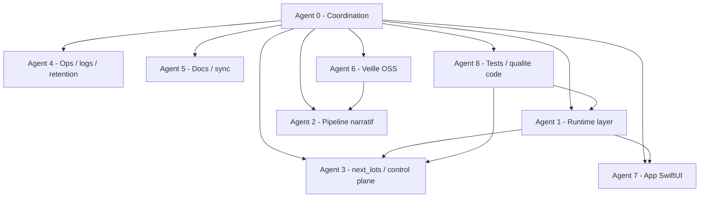

# Agents et sous-agents - 21 mars 2026

Carte operative mise a jour pour la refonte ANE.

## Carte d'ensemble

## Agent 0 - Coordination

- mission: tenir le point de reprise officiel, arbitrer les lots, garder le repo coherent
- livrables: `TODO_ACTIVE.md`, plans dates, memoires, arbitrages de purge

## Agent 1 - Runtime layer

- mission: rendre le runtime explicite et testable
- zones: `core/runtime/*`, `core/generation/provider.py`
- actif:
  - [x] extraire profil + client + health
  - [x] ajouter profils runtime nommes
  - [x] ajouter capacites explicites pour `response_format` et switch manuel
  - [x] extraire `remote_hosts.py` et `orchestration.py`

## Agent 2 - Pipeline narratif

- mission: garder ANE strictement auteurial
- zones: `core/generation/pipeline.py`, `prompts/*`
- actif:
  - [ ] ne pas laisser les contraintes runtime reinfiltrer le pipeline
  - [ ] reprendre `rewrite_v1` / `repair_v1` pour `qwen2.5:7b`
  - [ ] comprendre `mistral-nemo`

## Agent 3 - next_lots / control plane

- mission: decouper orchestration, preflight runtime et checkpoint manuel
- zones: `core/next_lots.py`, `automation/next_lots.toml`, scripts de reprise
- actif:
  - [x] sortir les checkpoints runtime du monolithe
  - [x] brancher les profils runtime
  - [x] sortir le plan runtime et les signaux checkpoint hors du runner
  - [ ] proteger les reports references des purges

## Agent 4 - Ops / logs / retention

- mission: garder des TUIs et logs lisibles, puis purger sans perdre de references
- zones: `scripts/ops_tui.py`, `scripts/reports_ops.py`, `automation/reports/`
- actif:
  - [x] analyser les top erreurs stderr
  - [x] converger le TUI remote Mascarade sur la couche runtime partagee
  - [ ] durcir la retention des reports documentes

## Agent 5 - Docs / sync

- mission: resynchroniser l'histoire du repo avec l'etat reel
- zones: docs racine + docs app
- actif:
  - [x] ouvrir un nouveau point de reprise au 21 mars
  - [ ] realigner toutes les references stale du 16 mars qui sont devenues fausses

## Agent 6 - Veille OSS

- mission: reperer les briques reutilisables sans transformer ANE en framework generique
- actif:
  - [x] sourcer `llama.cpp`, `lm-format-enforcer`, `Outlines`, `DeepEval`, `LiteLLM`, `Open WebUI`, `WritingBench`
  - [ ] traduire la veille en decisions d'implementation concretes

## Agent 7 - App SwiftUI

- mission: aligner l'app avec l'architecture ANE + Mascarade
- zones: `app_AI-novel-engine/Sources/AINovelEngineStudio/*`
- actif:
  - [x] backend selector OpenAI / Mascarade
  - [x] test connection
  - [x] lancement pipeline ANE
  - [ ] resynchroniser plans/TODOs/docs de l'app

## Agent 8 - Tests / qualite code

- mission: garder chaque lot couvert et relancable
- actif:
  - [x] valider `152` tests Python verts apres extraction runtime
  - [x] ajouter tests dedies a la logique de profils runtime, TUI remote et execution runtime
  - [ ] clarifier la strategie de tests Swift de l'app
