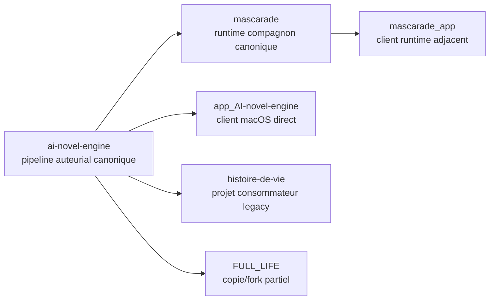

# Manifeste des repos annexes - 23 mars 2026

Cartographie courte des repos lies a `ai-novel-engine`, avec statut canonique, frontieres et decisions de gouvernance.

## Objectif

Eviter trois derives:

- confondre le moteur ANE avec le runtime local
- confondre un client ANE avec le moteur lui-meme
- laisser des forks, copies partielles ou projets narratifs parler au nom d'ANE sans statut explicite

## Doctrine

- `ai-novel-engine` reste la source de verite du pipeline auteurial, des garde-fous, des prompts narratifs et des reports ANE
- `mascarade` reste la source de verite du runtime local OpenAI-compatible, du serving et des checkpoints runtime
- un client ANE ne doit pas reconstruire librement l'arborescence interne d'ANE sans contrat stable
- un projet narratif consommateur ne doit pas etre traite comme spec du moteur
- un fork partiel ou snapshot incomplet ne doit pas rester ambigu: soit archive, soit reconstruit, soit supprime des points d'entree

## Carte

## Statut canonique

| Repo | Role vis-a-vis d'ANE | Couplage | Statut canonique | Source de verite | Decision |
|------|----------------------|----------|------------------|------------------|----------|
| `mascarade` | Runtime local, serving OpenAI-compatible, checkpoints, outillage remote | direct | canonique | `automation/next_lots.toml` cote ANE + `TODO_AI_NOVEL_ENGINE.md` cote Mascarade | garder comme unique repo runtime compagnon |
| `app_AI-novel-engine` | Client macOS ANE, UI auteur, Keychain, Git, pilotage du pipeline | direct | canonique mais frontiere a formaliser | docs du repo app + contrat ANE a expliciter | garder comme client direct, avec contrat runner stable |
| `histoire-de-vie` | Projet narratif historique avec prompts/chapitres annuels | indirect | legacy, non canonique pour le moteur | le projet lui-meme; pour le chantier courant preferer `histoire-de-vie-work` | ne plus l'utiliser comme reference du pipeline ANE |
| `FULL_LIFE` | Snapshot/fork partiel autour d'une biographie et d'une copie minimale d'ANE | confus | non canonique | aucune source stable exploitable | archiver, fusionner ou reconstruire; ne pas laisser ambigu |
| `mascarade_app` | Client macOS du runtime Mascarade, oriente ops/kanban | indirect | adjacent, hors chemin critique ANE | docs propres du repo | garder hors perimetre ANE tant qu'aucun contrat ANE explicite n'est consomme |

## Frontieres attendues

### 1. Ce qu'ANE possede

- pipeline auteurial
- logique `intention -> structure -> draft -> critique -> rewrite -> gate -> validation -> memoire`
- prompts narratifs
- artefacts ANE
- reports et suivi ANE

### 2. Ce que Mascarade possede

- compatibilite OpenAI
- routage provider
- runtime local/remote
- healthchecks runtime
- checkpoints de switch runtime

### 3. Ce qu'un client ANE peut posseder

- interface utilisateur
- edition de projet
- Keychain, persistance locale, Git utilisateur
- lancement du pipeline ANE via un contrat stable

### 4. Ce qu'un projet narratif possede

- contenu
- contexte
- chronologie
- docs editoriales et trous documentaires

## Anti-patterns a eviter

- un repo projet qui se presente comme `AI Novel Engine` alors qu'il n'embarque pas le moteur complet
- un client qui parse directement `meta.json` et suppose la forme interne des artefacts sans contrat versionne
- un repo runtime qui devient spec implicite du moteur
- plusieurs points d'entree README qui racontent des perimetres differents sans statut explicite

## Suites recommandees

1. Implementer la commande `runner execute` conforme au contrat [`ANE_RUNNER_CONTRACT_V1_2026-03-23.md`](./ANE_RUNNER_CONTRACT_V1_2026-03-23.md)
2. Marquer `histoire-de-vie` comme consommateur legacy et sortir `FULL_LIFE` du flou
3. Garder `mascarade` comme unique repo runtime de reference pour ANE
