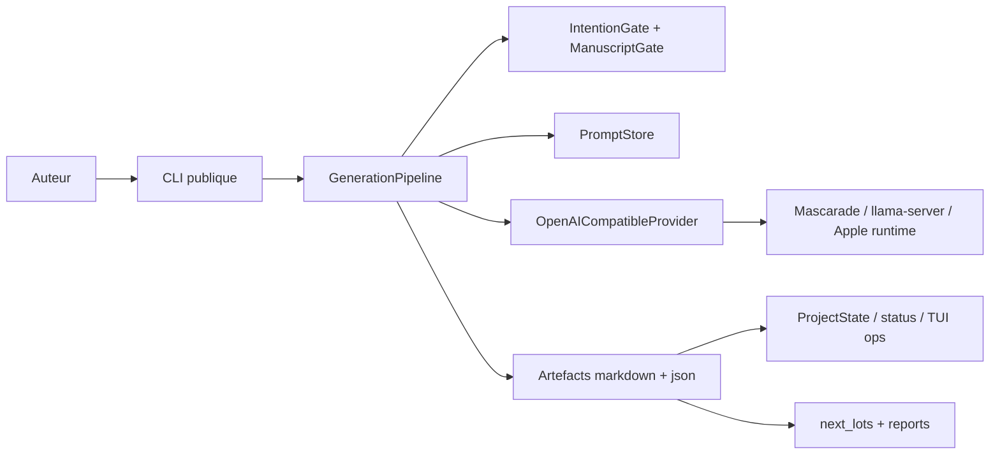
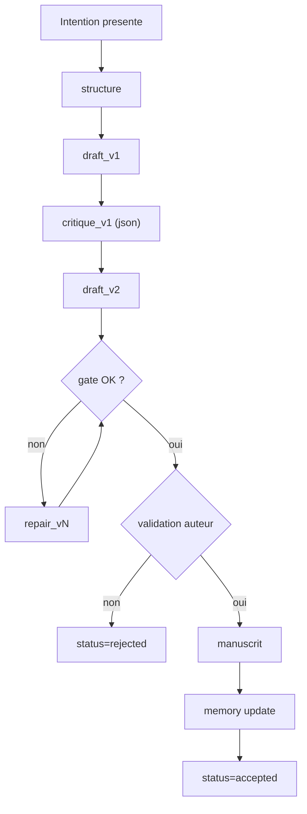
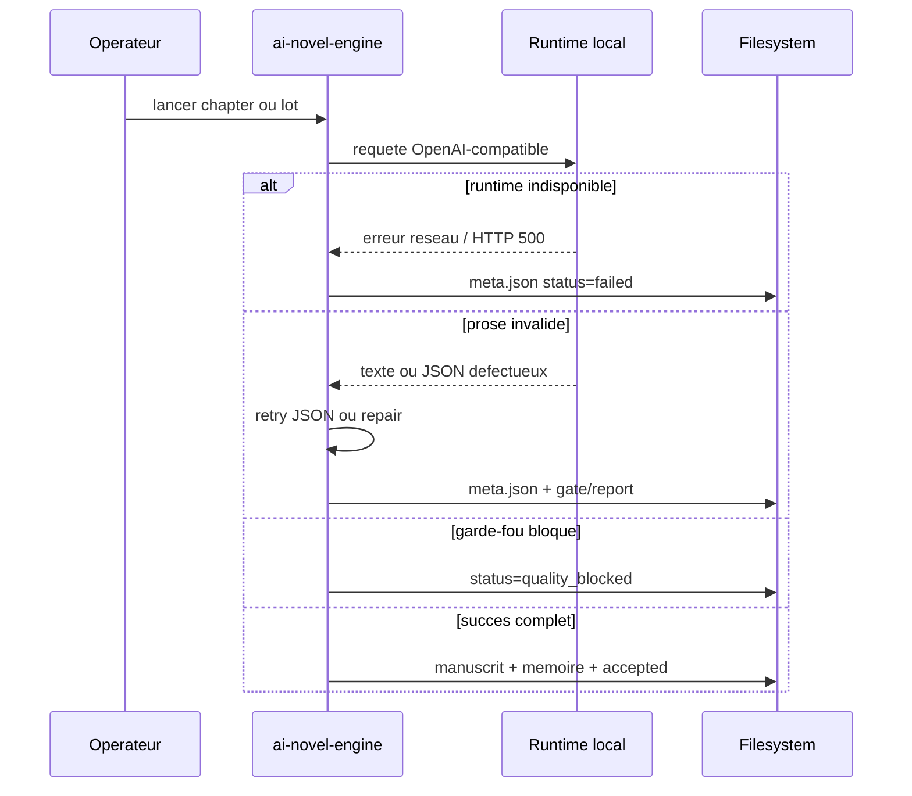

# System Spec - 16 mars 2026

Spec operative du systeme `ai-novel-engine`.

## Intention produit

Donner a un auteur un moteur de redaction longue:

- explicite
- relancable
- inspectable sur disque
- decouple du runtime LLM

## Invariants

- pas de generation sans intention
- pas de promotion manuscrit sans `gate`
- la memoire reste en fichiers, pas en base opaque
- le runtime local doit rester interchangeable derriere un contrat OpenAI-compatible minimal

## Topologie

## Workflow narratif

## Contrat runtime

Le contrat stable cote ANE est volontairement petit:

- `POST /v1/chat/completions`
- `model=provider:model`
- reponse non-streaming
- JSON best-effort pour `critique`, `gate`, `memory`

Refonte en cours:

- `core/runtime/*` porte les profils runtime, contraintes explicites et checks de sante
- `core/generation/*` garde le pipeline narratif, le gate et les retries applicatifs

## Surfaces utilisateur

- CLI auteur: `python3 -m cli.main`
- smoke: `scripts/smoke_local_generation.sh`
- orchestration lots: `scripts/run_next_lots.py`
- supervision lots: `scripts/next_lots_tui.py`
- supervision ops globale: `scripts/ops_tui.py`
- synthese/purge reports: `scripts/reports_ops.py`

## Artefacts

| Zone | Raison d'etre | Format |
|---|---|---|
| `notes/intentions/` | entree auteur obligatoire | Markdown |
| `structure/chapitres/` | plan de chapitre | Markdown |
| `brouillons/chapitres/` | drafts, critique, gate, repair, meta | Markdown + JSON |
| `manuscrit/` | chapitre accepte | Markdown |
| `memoire/chapitres/` | resume memoire par chapitre | Markdown |
| `memoire/index/` | personnages, lieux, chronologie | JSON |
| `automation/reports/` | evidence packs d'orchestration | JSON + logs + workspaces |

## Etats principaux

- `started`
- `structure_ready`
- `draft_ready`
- `critique_ready`
- `rewrite_ready`
- `repair_ready`
- `awaiting_acceptance`
- `accepted`
- `rejected`
- `quality_blocked`
- `failed`

## Failure model

## Hotspots techniques

- `core/generation/pipeline.py`: logique centrale et heuristiques qualite
- `core/next_lots.py`: orchestration, checkpoints, synchronisation docs
- `scripts/reports_ops.py` et `scripts/ops_tui.py`: observabilite operateur

## Ce que le systeme ne fait pas encore

- studio collaboratif riche
- edition visuelle des artefacts
- persistence multi-utilisateur
- orchestration autonome idee -> roman final
