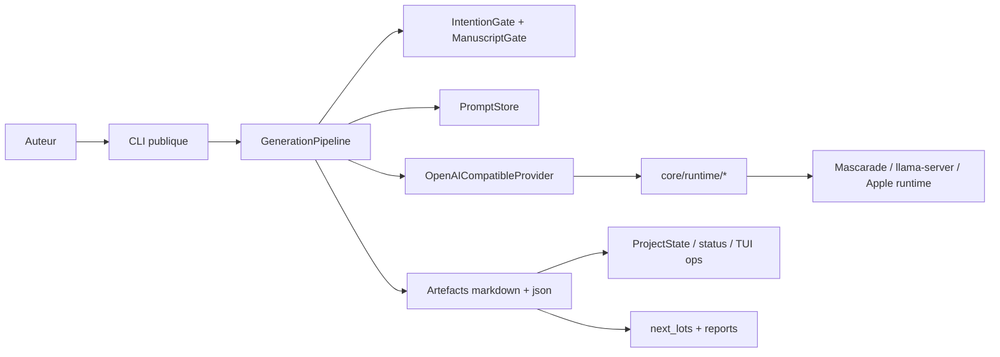

# System Spec - 21 mars 2026

Spec operative du systeme `ai-novel-engine` apres extraction de la couche runtime minimale.

## Intention produit

Donner a un auteur un moteur de redaction longue :

- explicite
- relancable
- inspectable sur disque
- decouple du runtime LLM

## Invariants

- pas de generation sans intention
- pas de promotion manuscrit sans `gate`
- la memoire reste en fichiers, pas en base opaque
- le runtime local doit rester interchangeable derriere un contrat OpenAI-compatible minimal
- les contraintes runtime doivent etre encodees dans une couche dediee, pas dispersees dans le pipeline

## Topologie

## Contrat runtime

Le contrat stable cote ANE reste volontairement petit :

- `POST /v1/chat/completions`
- `model=provider:model`
- reponse non-streaming
- JSON best-effort, avec reessai applicatif cote ANE

## Contrat runner app

Le pont entre un client applicatif et ANE ne doit plus reposer sur le parse direct de `meta.json`.

Le contrat canonique cible est documente dans:

- [`ANE_RUNNER_CONTRACT_V1_2026-03-23.md`](./ANE_RUNNER_CONTRACT_V1_2026-03-23.md)

Ce contrat borne:

- la commande runner stable cote ANE
- la requete JSON envoyee par un client
- le resultat JSON public restitue au client

Le mode historique `python3 -m cli.main generate chapter --chapter XX` reste un mode legacy de transition, pas l'interface applicative de long terme.

## Capacites runtime a expliciter

- support reel de `response_format`
- besoin de switch manuel de modele
- provider actif derive de `provider:model`
- sante runtime lisible via `/health`

## Hotspots techniques

- `core/runtime/client.py` : transport OpenAI-compatible
- `core/generation/pipeline.py` : logique narrative et garde-fous
- `core/next_lots.py` : orchestration a decoupler
- `app_AI-novel-engine/.../ANEPipelineService.swift` : pont app -> CLI ANE
