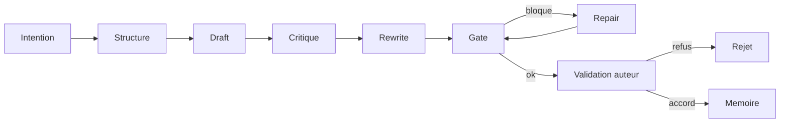

# Workflow ANE

Vue courte du workflow utile.

Regles:

- pas d'intention, pas de generation
- pas de `gate` vert, pas de promotion manuscrit
- `repair` existe pour sauver un brouillon, pas pour contourner le garde-fou
- la memoire n'est mise a jour qu'apres validation auteur
